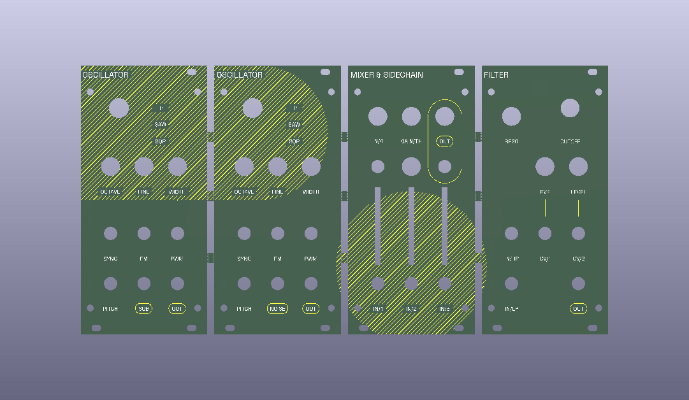

# Moduleur Faceplates



Eurorack PCB faceplates and automated panelization tooling for the **[Moduleur](https://github.com/shmoergh/moduleur)** modular synthesizer.

---

## Original Source & Attribution

The mechanical CAD files (DXF) and vector art (SVG) used in this repository originate from the open-source **[Moduleur](https://github.com/shmoergh/moduleur)** synthesizer project created by **[Shmøergh](https://shmoergh.com/)**.

Moduleur is an open-source, fully analog Eurorack modular synthesizer designed to balance the flexibility of modular synthesis with the playability of a cohesive instrument.

- **DXF Cutouts (`DXFs/`):** Define the mechanical hole patterns, Eurorack oval mounting slots, potentiometer cutouts, and 3.5 mm jack placements for the individual modules (`brain`, `vco`, `sidechain-mixer`, `vcf`, `envelope-vca`, and `crush-lfo-output`).
- **SVG Artwork (`SVGs/`):** Provide vector graphics layered across the panels, including front copper, silkscreen, and graphics (`front-copper-clean.svg`, `front-silkscreen-clean.svg`, `front-graphics-clean.svg`, `front-edges-clean.svg`).

---

## Panel Overview

The faceplates are organized into two unified 3U Eurorack panels. Each panel is **48HP** wide (~252.5–252.9 mm × 128.5 mm) and consists of **four 12HP faceplates** arranged side-by-side sharing continuous front artwork:

### 1. VCO Panel (`VCO/`)
Houses the primary audio generation, mixing, and filtering modules (in order, left to right):
1. **VCO** (12HP)
2. **VCO** (12HP)
3. **Mixer and Sidechain** (12HP)
4. **VCF** (12HP)

### 2. VCA Panel (`VCA/`)
Houses the modulation, control, utility, and brain modules (in order, left to right):
1. **VCA and EG** (12HP)
2. **VCA and EG** (12HP)
3. **Utility** (12HP)
4. **Brain** (12HP)

### Directory Contents
For each panel directory (`VCO/` and `VCA/`):
- `<Name>.kicad_pcb`: The source KiCad 10 PCB layout containing the four individual board outlines and continuous artwork.
- `<Name>_panel.kicad_pcb`: The generated panelized PCB joined with mousebites across the inter-board seams.
- `jlcpcb/`: Production-ready fabrication files including Gerber archives (`GERBER-<Name>_panel.zip`), drill maps, and component placement files formatted for JLCPCB manufacturing.

---

## The Panelization Skill

The repository includes a custom agent skill located in [`.agents/skills/panelize/`](.agents/skills/panelize/SKILL.md) backed by the script [`scripts/panelize.py`](.agents/skills/panelize/scripts/panelize.py).

### Design & Architecture

Standard PCB panelizers usually require surrounding frame rails or separate rectangular board copies. Eurorack faceplates, however, present unique constraints:
- **No Outer Rails:** Faceplates must maintain exact Eurorack outer dimensions (128.5 mm height, 48HP width) to minimize raw PCB material costs and avoid rail-removal post-processing.
- **Continuous Artwork:** Graphical artwork, copper fills, and silkscreen often cross board boundaries. Standard panel extraction can accidentally clip elements that extend slightly beyond the `Edge.Cuts` boundary.
- **Burr-Free Edges:** When breaking boards apart after fabrication, mousebite breakout tabs often leave rough burrs. If tabs break on the outer perimeter, the module might not fit flush into a Eurorack rack case.

The skill solves these challenges using **[KiKit](https://yaqwsx.github.io/KiKit/)**, **[Shapely](https://shapely.readthedocs.io/)**, and **KiCad's `pcbnew` Python API**:

1. **Interpreter Isolation via `uv`:** On macOS, KiCad's C++ Python module (`pcbnew`) requires KiCad's bundled Python 3.9 runtime. The script declares dependencies (`kikit>=1.6.0`, `shapely>=2.0.0`) via [PEP 723](https://peps.python.org/pep-0723/) inline script metadata, allowing `uv run` to execute directly with KiCad's Python interpreter without polluting system environments.
2. **Automatic Artwork Bounds Inspection:** Before panelization, the script calculates the bounding box of all graphical drawings on the board. If artwork overflows `Edge.Cuts`, it expands the source extraction tolerance buffer so that continuous graphics are fully preserved.
3. **Sub-Board Detection:** Discovers individual faceplate polygons along the X-axis and calculates exact gap seam dimensions between boards.
4. **Selective Substrate Bridging:** Bridges each inter-board gap with rectangular tabs at designated Y positions (defaulting to **34.0 mm, 62.5 mm, and 92.0 mm**), safely clear of Eurorack oval mounting slots and component drill holes.
5. **Recessed Mousebites:** Directional line vectors (`LineString`) orient KiKit's mousebite perforation cuts so that drill holes are recessed by `0.25 mm` into the waste tab. When broken apart, any remaining burrs remain within the seam space rather than protruding beyond the faceplate edge.
6. **Substrate Validation:** Automatically reloads the resulting board to verify that `Substrate.isSinglePiece()` passes.

### Usage

Run the panelizer using [`uv`](https://docs.astral.sh/uv/) and KiCad's bundled Python:

```bash
uv run --python /Applications/KiCad/KiCad.app/Contents/Frameworks/Python.framework/Versions/3.9/bin/python3 \
  .agents/skills/panelize/scripts/panelize.py -i <path/to/board.kicad_pcb>
```

#### Example: Panelizing VCA and VCO

```bash
# Panelize the VCA layout
uv run --python /Applications/KiCad/KiCad.app/Contents/Frameworks/Python.framework/Versions/3.9/bin/python3 \
  .agents/skills/panelize/scripts/panelize.py -i VCA/VCA.kicad_pcb

# Panelize the VCO layout
uv run --python /Applications/KiCad/KiCad.app/Contents/Frameworks/Python.framework/Versions/3.9/bin/python3 \
  .agents/skills/panelize/scripts/panelize.py -i VCO/VCO.kicad_pcb
```

#### CLI Options

| Option | Default | Description |
| :--- | :--- | :--- |
| `-i`, `--input` | `VCO/VCO.kicad_pcb` | Path to source KiCad PCB layout |
| `-o`, `--output` | `<dir>/<stem>_panel.kicad_pcb` | Output path for panelized PCB layout |
| `--tab-width` | `5.0` | Width of each break-off tab (mm) |
| `--tab-positions` | `34.0 62.5 92.0` | Vertical Y-coordinates (mm from top edge) for bridge tabs |
| `--hole-diameter` | `0.5` | Drill hole diameter for mousebite perforations (mm) |
| `--hole-spacing` | `0.75` | Center-to-center pitch of mousebite holes (mm) |
| `--mousebite-offset` | `0.25` | Inset offset into tab to prevent protruding burrs (mm) |
| `--tolerance` | `None` (auto) | Extraction tolerance in mm for artwork extending beyond board edges |

---

## Repository Structure

```
.
├── .agents/
│   └── skills/
│       └── panelize/           # Custom agent skill definition & scripts
│           ├── SKILL.md
│           └── scripts/
│               └── panelize.py
├── DXFs/                       # Mechanical DXF cutouts from Moduleur
├── SVGs/                       # Front panel vector artwork layers
├── VCA/                        # VCA 48HP panel KiCad project & manufacturing files
│   ├── VCA.kicad_pcb
│   ├── VCA_panel.kicad_pcb
│   └── jlcpcb/
├── VCO/                        # VCO 48HP panel KiCad project & manufacturing files
│   ├── VCO.kicad_pcb
│   ├── VCO_panel.kicad_pcb
│   └── jlcpcb/
├── LICENSE
└── README.md
```

---

## License

This project incorporates assets from the [Moduleur](https://github.com/shmoergh/moduleur) project. As such, the hardware follows the same license as that project.
The licensing is as follows:

- **Hardware & Faceplate Designs:** [Creative Commons Attribution-NonCommercial 4.0 International (CC BY-NC 4.0)](https://creativecommons.org/licenses/by-nc/4.0/)
- **Software & Tooling:** [Apache License, Version 2.0](https://www.apache.org/licenses/LICENSE-2.0)

See [LICENSE](LICENSE) for full terms.

---

## Disclaimer

This is not an officially supported Google product.
